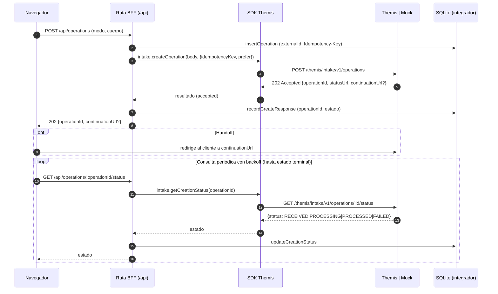
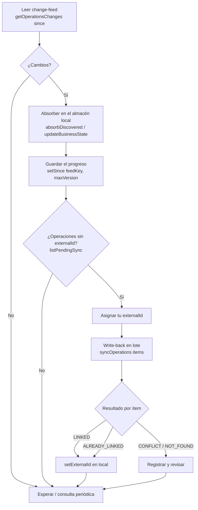

# Arquitectura

Este documento describe cómo está montado `themis-integrator` por dentro: las
capas, el flujo de una petición, el modelo de datos local, cómo funciona el
backend simulado (mock) y las decisiones de diseño que conviene entender antes de
adaptar el integrador a tu sistema.

Idea central: **el navegador nunca ve credenciales de Themis**. Todo lo que toca
la API pasa por el servidor.

---

## Capas

```
Navegador ──▶ Rutas BFF (/api) ──▶ SDK de Themis ──▶ Themis (real) | Mock (local)
                    │                     │
                    └── Almacén local (SQLite) ◀── auditoría / estado / feed
```

### 1. BFF — route handlers (`src/app/api/**`)

Cada ruta de `/api` es un *Backend For Frontend*: se ejecuta **solo en el
servidor**, obtiene el cliente de Themis, hace la llamada y persiste lo que
corresponda en el almacén local. El navegador habla únicamente con estas rutas
(vía `apiFetch`), nunca con Themis.

Rutas principales:

- `GET /api/operations` — listado (`query.listOperations`) con filtros.
- `POST /api/operations` — alta (`intake.createOperation`) + persistencia del
	mapeo `externalId ↔ operationId` y del estado.
- `GET /api/operations/:operationId` — detalle (con PII).
- `GET /api/operations/:operationId/status` — estado del alta (consulta periódica).
- `GET /api/operations/:operationId/history` — histórico.
- `POST /api/changes` — change-feed (`query.getOperationsChanges`) + progreso `since`.
- `GET /api/reconciliation/pending` y `POST /api/reconciliation/write-back` —
	descubrir y conciliar (`intake.listPendingSync` / `intake.syncOperations`).
- `POST /api/handoff/redeem` y `GET /api/handoff/status` — canje del launchToken y
	estado con la sesión de handoff.
- `POST /api/settings/reset` — vacía el almacén local del integrador.

Tres helpers (`src/lib/server/respond.ts`) dan homogeneidad:

- **`audited({ method, path, note }, fn)`** envuelve la llamada a Themis, mide el
	tiempo y registra el resultado (status/código) en el log de auditoría.
- **`problemResponse(error, exchanges?)`** traduce cualquier error a
	`application/problem+json`, de modo que la UI siempre recibe el **mismo
	contrato de error** que expone Themis. Si se le pasan los intercambios, los
	adjunta también en el error (ver [inspector](#inspector-de-requestresponse)).
- **`withExchanges(data, exchanges)`** adjunta los intercambios con Themis al
	cuerpo de una respuesta OK bajo la clave `_themis`.

Las páginas que leen Themis o la base de datos son dinámicas
(`export const dynamic = 'force-dynamic'`).

### 2. SDK de Themis (`src/lib/themis`, *server-only*)

Se compone por capas, de abajo a arriba:

- **`config.ts`** — resuelve el entorno (`THEMIS_ENV`) a una URL base, lee el flag
	`THEMIS_MOCK` y las credenciales M2M. Marcado `server-only`: nunca llega al
	bundle del navegador.
- **`token.ts`** — canjea las credenciales por un `access_token` (JWT, ~60 min,
	sin refresh) y lo **cachea en memoria** del proceso hasta poco antes de expirar.
	Ante un `401` en carrera, invalida el token y reintenta una vez.
- **`http.ts`** — el **transporte**. Hay dos: el real (`fetch`) y el mock. Un
	transporte devuelve la respuesta cruda sin lanzar por status; `sendRequest`
	construye el `ThemisError` y **reintenta 429/5xx con *backoff* exponencial**,
	respetando `Retry-After`. Aquí vive también **`withCapture`**, que envuelve un
	transporte para **registrar cada intercambio** (request/response) redactando
	credenciales.
- **`client.ts`** — un `request` genérico ya autenticado, que aplica las cabeceras
	`Prefer` (RFC 7240) e `Idempotency-Key`.
- **`intake.ts`** — área de escritura: `createOperation` (doble vía `201`/`202`),
	`getCreationStatus`, `syncOperations` (write-back), `listPendingSync`,
	`redeemLaunchToken` y `getHandoffStatus`.
- **`query.ts`** — área de lectura: `listOperations`, `getOperationsChanges`
	(change-feed), `getOperation` (detalle con PII) y `getOperationHistory`.
- **`types.ts` / `schema.ts`** — el contrato en TypeScript y su validación con
	`zod`. Cubren el alta completa: intervinientes (titulares/avalistas), inmueble o
	subrogación y la **oferta y bonificaciones** opcionales (`ThemisOfferInputDto`:
	tipo, TIN/cuota, TAE, tramos y las 8 vinculaciones con `bonusValue ≤ 0` /
	`costValue ≥ 0`).
- **`errors.ts`** — `ThemisError` en formato `application/problem+json`
	(RFC 9457). El campo estable para decidir en código es **`code`** (nunca
	parsees `detail`).
- **`exchange.ts`** — el tipo `ThemisExchange` (sin `server-only`) que describe un
	intercambio HTTP capturado; lo comparten el SDK y el inspector de la UI.

`getThemisClient()` compone config + transporte (envuelto con `withCapture`) +
token y devuelve `{ config, client, intake, query, getExchanges }`, donde
`getExchanges()` da los intercambios registrados durante la vida del cliente.

### 3. Capa SQLite (`src/lib/db`, *server-only*)

El **almacén del integrador** (`integrator.db`, por defecto `./data`). Es "tu
lado" de la integración: qué has enviado, qué te ha contado Themis y por dónde vas
consumiendo el feed. Ver el [modelo de datos](#modelo-de-datos-local).

### 4. Backend mock (`src/lib/themis/mock`)

La simulación de Themis, activa solo con `THEMIS_MOCK=1`. Vive en **su propia**
base de datos (`themis-mock.db`), separada del almacén del integrador, para
modelar fielmente los dos lados de la integración. Ver [cómo funciona el
mock](#cómo-funciona-el-mock).

---

## El flujo de una petición

Toda petición sigue el mismo camino: **navegador → ruta BFF → SDK →
Themis | mock**, y de vuelta. El siguiente diagrama muestra el alta en modo
handoff / asíncrono y el posterior seguimiento del estado por consulta periódica.



En el camino **S2S síncrono** cambia solo el arranque: el BFF envía
`Prefer: wait=N` y Themis puede responder `201` con el recurso de la operación ya
creado (sin bucle de consulta); si no da tiempo, degrada a `202` y se sigue igual.

---

## Inspector de request/response

Un objetivo del integrador es **enseñar cómo es la petición a realizar**. Para
ello, cada pantalla que llama a Themis muestra un desplegable con el request y la
response reales (cabeceras + body) de cada intercambio. El recorrido del dato:

```
withCapture (SDK) ─registra→ exchanges[]  ──getExchanges()──▶ ruta BFF
   │ (redacta bearer/secretos)                                    │
   │                                          withExchanges(data) │ éxito → body._themis
   │                                          problemResponse(…,ex)│ error → problem._themis
   ▼                                                               ▼
ThemisExchange (exchange.ts) ◀──────── apiFetch / props ──────── RequestInspector (cliente)
```

1. **Captura.** `withCapture` (en `http.ts`) envuelve el transporte y, por cada
	llamada, guarda un `ThemisExchange` (método, URL, cabeceras y body de request y
	response, duración y status). `getThemisClient()` acumula todos en un array que
	expone con `getExchanges()`.
2. **Redacción.** Antes de guardar, se enmascaran los secretos: `Authorization:
	Bearer …` se muestra como `Bearer «redactado»`, y en el canje de token los
	campos `apiSecret`/`token` como `«redactado»`. **Nunca** salen en claro.
3. **Transporte a la UI.**
	- **Páginas de servidor** (listado, detalle) leen `themis.getExchanges()` y se lo
		pasan como props al inspector.
	- **Rutas BFF** adjuntan los intercambios al cuerpo bajo `_themis`: con
		`withExchanges(...)` en las respuestas OK y con `problemResponse(error, ex)` en
		los **errores** (así también ves el request que provocó un `400`/`404`/`409`).
		El cliente los lee del cuerpo (`WithExchanges<T>`) o de `ApiError.exchanges`.
4. **Render.** El componente `RequestInspector` (`src/components/request-inspector.tsx`)
	pinta el desplegable, un bloque por intercambio.

Como los secretos se redactan en la capa de captura (servidor), el navegador nunca
recibe credenciales aunque muestre las cabeceras.

---

## Modelo de datos local

El almacén del integrador (`integrator.db`) tiene tres tablas:

### `operations`

El corazón del integrador: **una fila por operación tuya**. Guarda el mapeo
`external_id ↔ operation_id`, un *snapshot* del cuerpo del alta (`request_json`),
el estado del alta (`creation_status`) y el estado de negocio que vas conociendo
por las lecturas (`business_status`, `stage`, `substage`), además de `origin`,
`amount`, `province` y las URLs de la respuesta (`status_url`, `continuation_url`).

- `external_id` y `operation_id` son **únicos** (permiten idempotencia de negocio
	y evitan duplicados).
- `idempotency_key` se guarda para poder **reintentar de forma idempotente** un
	alta que quedó en el aire.

### `feed_state`

El **progreso del change-feed**. Una fila por combinación de filtros
(`feed_key`, p. ej. `changes:ALL:LINKED`) con el último `since` (la última
`version` procesada). Así el consumo del feed es **incremental**: retomas donde lo
dejaste.

### `audit_log`

Un **log de auditoría** de las llamadas a Themis (`method`, `path`, `status`,
`code`, `duration_ms`, `note`). Da trazabilidad "de integrador" y alimenta la vista
de auditoría.

---

## Cómo funciona el mock

El backend simulado respeta la **semántica del contrato** (idempotencia, handoff,
`202`/`201`, write-back por-ítem, change-feed con `version`) sobre tres tablas:
`mock_operations`, `mock_idempotency` y `mock_meta` (un contador `versionSeq`).

Claves de su comportamiento:

- **Estado del alta derivado del tiempo.** Cada operación guarda
	`creation_started_at`. Al consultar su estado, el mock lo deriva del tiempo
	transcurrido: `RECEIVED` (primer tramo) → `PROCESSING` → `PROCESSED` (o
	`FAILED` si se pidió simular un fallo). Así ves el alta "progresar" de verdad
	mientras la consultas de forma periódica.
- **`version` que avanza al leer (el *drift*).** Existe un contador monotónico
	global. Cuando una lectura *materializa* el avance de una operación, **sube su
	`version`**. El change-feed ordena por `version` y devuelve lo posterior a tu
	`since`: por eso el feed refleja cambios sin necesidad de que Themis te avise.
- **Seed de autoprescripciones.** Al crear la BD se siembran operaciones de
	ejemplo: unas con `externalId` (origen `INTAKE`) y varias de origen
	`AUTOPRESCRIPTION` **sin `externalId`**, que aparecen como **pendientes de
	conciliar** para poder probar el write-back de extremo a extremo.
- **Idempotencia y handoff.** Reconoce la misma `Idempotency-Key` (idempotencia
	HTTP) y el mismo `externalId` (idempotencia de negocio) devolviendo la operación
	existente; y emite un `launchToken` de **un solo uso** que se canjea por un
	`sessionToken` de handoff.

El mock usa **cursores opacos** (base64url) igual que el contrato real, para que el
código del integrador no dependa de que arranques en modo mock o real.

---

## El ciclo de conciliación

El change-feed y la conciliación comparten mecánica pero tienen objetivos
distintos:

- **Descubrir cambios (*drift*)** es lo primero y lo más general: el change-feed
	aplica a **todas** tus operaciones (defaults del contrato: `origin: ALL`,
	`linked: LINKED`). Sirve para enterarte de cambios de estado/etapa de
	operaciones que ya tienes.
- **El write-back** es un caso concreto: enlazar operaciones que Themis conoce pero
	tú aún no has referenciado (típicamente `origin: AUTOPRESCRIPTION` +
	`linked: UNLINKED`). Puede **no aplicar** a un integrador que solo origina
	operaciones dándolas de alta.



---

## Decisiones de diseño

- **Idempotencia en dos capas.** La **`Idempotency-Key`** (RFC, por operación de
	escritura) protege ante reintentos de red; el **`externalId`** (único por marca)
	protege ante duplicados de negocio. El BFF, si ya tiene una fila local para ese
	`externalId`, **reutiliza su `Idempotency-Key`**: un reintento idempotente de
	verdad.
- **Backoff en dos niveles.** El **transporte del SDK** reintenta `429`/`5xx` con
	*backoff* exponencial y `Retry-After`. El **navegador** consulta el estado del
	alta con *backoff* acotado (`backoffSchedule`) hasta un estado terminal, para no
	martillear la API.
- **Cursores opacos.** La paginación y el change-feed usan *cursores* que **no
	debes interpretar**: guarda el `nextCursor` (o el `since`) y devuélvelo tal cual
	en la siguiente petición.
- **Separación índice / detalle como decisión de seguridad.** Los listados y el
	change-feed son un **índice sin datos personales**; el **detalle** (con PII) se
	consulta **una operación cada vez**.
- **Aislamiento por marca.** Una operación que no es tuya responde **`404`** (no
	`403`): no revelamos ni su existencia.
- **Dos bases de datos separadas.** El almacén del integrador (`integrator.db`) y el
	backend simulado (`themis-mock.db`) son ficheros distintos, para no mezclar "tu
	lado" con la simulación del "lado Themis".
- **Observabilidad con redacción en el servidor.** Los intercambios request/response
	se capturan y **redactan en el SDK** (lado servidor). La UI puede mostrarlos
	enteros —para que el integrador aprenda el contrato— sin que el bearer ni los
	secretos M2M lleguen nunca al navegador.
